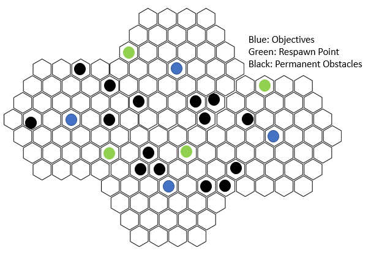

# Table of Contents

- [Overview](#Overview)
- [Units and Classes](#Units-and-Classes)
- [The Board](#The-Board)
- [Game Flow](#Game-Flow)
- [Respawning Units](#Respawning-Units)
- [Your Units](#Your-Units)
- [Health](#Health)
- [Attack](#Attack)
- [Movement](#Movement)
- [Special](#Special)
- [Reaction](#Reaction)
- [Damage](#Damage)
- [Armor](#Armor)
- [Evasion and Hit Modifier](#Evasion-and-Hit-Modifier)
- [Leveling Up](#Leveling-Up)
- [Gaining Victory Points](#Gaining-Victory-Points)
- [Line of Sight](#Line-of-Sight)
- [Ranged Attacks](#Ranged-Attacks)
- [Objectives](#Objectives)
- [Beginning a Game](#Beginning-a-Game)
- [Start of Round](#Start-of-Round)
- [Your Turn](#Your-Turn)
- [Obstacles](#Obstacles)
- [Wounding](#Wounding)
- [Piercing](#Piercing)
- [Swift](#Swift)
- [Area of Effect(AOE)](#Area-of-Effect-(AOE))

- [Classes](#Classes)
- [Warrior](#Warrior)
- [Assassin](#Assassin)
- [Mage](#Mage)
- [Engineer](#Engineer)

# Overview
Analog Tactics is a game where each player controls a group of units. By securing objectives and eliminating enemy units, you gain victory points (VP) and experience points (XP) to level up your own units. You win the game by being the first to gain 15 victory points.

## Units and Classes
- A player chooses a base class at the beginnning of the game: Warrior, Assassin, Mage, Engineer
- Each player controls their team of units, consisting of 1 Elite unit and 4 Common units

## The Board
- The game board consists of hexagonal spaces within a standard template 
- Each hexagonal space is referred to as a ‘space’ in relevant abilities
- The number of standard templates should be 1 more than the number of players
- Permanent respawn points are placed by each player at the beginning of the game, and include the same number as the number of players
- Respawn points are separately placed and should include the same number as the number of objectives
- The number of permanent [obstacles](#Obstacles) are determined by the players based on how populated you want the map to be. A standard game has 4 per number of standard templates
- On the sample board, blue spaces designate objectives, and green spaces designate respawn points, and black spaces designate permanent Obstacles. Objective and obstacle placements can change to suit players’ preferences.

- A sample board for 3 players

- Sample board with sample obstacles

##### Orientation

- Units (U) have orientations depicted with an arrow. The front space is ‘1’, moving clockwise increasing to ‘6’

## Game Flow

- The game consists of round and turns.
- A round begins before the first player takes their turn. Use the time before the first player takes their turn to decide unit upgrades and note refreshed points
- At the beginning of a round, all units refresh their expendable attribute points
- Units respawn at the beginning of that player’s turn unless stated otherwise
- Any dice rolls use a six-sided die, and are referred to as a D6

## Respawning Units
- At the beginning of your turn, you may respawn a unit within your designated respawn area or within 1 space of an objective you control.
- There are capturable respawn points that populate the map
- You may also respawn units based on each class's own respawn rules

[Back to Top](#Table-of-Contents)

## Your Units
- Each unit is defined by its attributes and the values associated with its attributes
- A player takes their turn, using their units’ points to move, attack, and use abilities until they cannot do anything else, or voluntarily ends their turn

##### Expendable Attribute: Attack, Movement, Special, Reaction
- Expendable attributes decrease every time you use an action of that attribute type
- At the beginning of the round, all expendable attributes are refreshed

##### Constant Attributes: Damage, Armor, Evasion, Hit
- Constant attributes do not change when used

##### Attributes
- Health (HP) – If this number reaches 0, your unit is eliminated. Remove the unit from the board.
- Attack – Use 1 attack point to deal damage equal to your damage attribute
- Movement – Move a unit 1 space per point
- Special – Points used for special abilities
- Reaction – Points used for reaction abilities
- Damage – Amount of health taken away from 1 standard attack
- Armor – Subtract this number from an enemy attack’s damage
- Evasion – Modifier added to any evasion rolls
- Hit – Modifier added to any attack rolls

## Health
- Health is subtracted whenever your unit is [damaged](#Damage)
- When health reaches 0 the affected unit is removed from play and 'eliminated'
- If a unit is eliminated, remove it from the board
- Health does not refresh across rounds unless stated otherwise
- Leveling up affects the maximum health of a unit, but does not immediately affect a unit’s current health, i.e. if a unit currently has 5 HP and levels up, any increases to maximum health do not raise the unit’s HP from 5 to 6 at the beginning of the next round

## Attack
- All initiated attacks are Range 1 unless otherwise stated
- Attack points are refreshed every round
- You may target enemy units within line of sight. For range 1 attacks (1 space away) you may target units in the front 3 spaces (1,2,6). If you wish to target units outside of these spaces, you must use movement points to either change orientation or move towards the enemy unit.
- Abilities may use 'Attack' as a keyword. If 'Attack' is mentioned in the ability, it is implied that an evasion and hit roll determines success of the attack.

## Movement
- Expend a Movement point to move a unit and/or change its orientation. Both are optional.
- Movement points refresh after every round
- Any spaces with a unit on it is considered occupied
- Units cannot move through occupied spaces unless otherwise noted

### Example Movement: 
Unit U starts at position U with 2 movement points. U moves to U’ and spends 1 movement point, and has 1 left. U moves from U’ to U’’, spending the last movement point. U can no longer move because it has 0 movement points remaining. The unit will be able to move again next turn after refreshing its movement points.

## Special
- Expend a Special point when using an ability with a Special cost
- Special points refresh after each round
- Some abilites are described as being an 'Attack'. Abilities that are 'Attacks' use attacking mechanics and may be reacted to as Attacks
- Some abilities cost a Special point and are described with 'on successful attack'. After the attack is resolved (determining hit and evasion), you may use the ability to modify your attack and apply its effect. 

## Reaction
- Expend a Reaction point to use a Reaction
- Reactions may be used whenever the conditions described by the reaction ability are met
- In general, Reactions can be used after (or sometimes before) a 'step' in the game has occurred. A 'step' includes taking any action by using a point, evaluating the effect of using of a point, taking damage, losing health, etc. 
- Reaction points refresh after each round

## Damage
- Damage is the value associated with an initiated base attack
- Damage stays constant across rounds and is subject to change from leveling up or abilities
- Certain abilities use a predetermined damage amount instead of your damage attribute
- 'Losing Heath' is different than 'Taking Damage', as incoming damage is considered the precursor to losing health (after Armor/Reaction effects are considered).
- Dealing damage is not synonymous with a successful attack

## Armor
- If a unit is damaged during an attack, take the incoming damage of the attacking unit and subtract the targeted unit's Armor value. This value is subtracted from the targeted unit’s Health.
- Armor stays constant across rounds

## Evasion and Hit Modifier
- When initiating an attack or attacking ability, the initiating unit rolls a D6 ('rolling Hit'), then adds their Hit modifier. The targeted unit rolls a D6 ('rolling Evasion'), then adds their Evasion modifier. 
- If the initiating unit rolls higher, the attack is a success and damage is calculated and subtracted from the current health value of the targeted unit. 
- If the targeted unit rolls higher, the attack misses and no health is subtracted
- Ties go to the targeted unit, unless otherwise noted (rolling the same number results in an evasion)
- Base Evasion and Hit modifiers are constant attributes
- If an ability defines the Hit of an attack (ex. 6 Hit), the targeted unit rolls Evasion against that value and the initiator of the attack does not roll or add modifiers. Similarly, if an ability defines evasion (ex. 6 Evasion), the unit initiating the attack rolls Hit against that value and the defending unit does not roll Evasion.

[Back to Top](#Table-of-Contents)

## Leveling Up
- Every time your unit eliminates an enemy unit, you gain 1XP
- When you gain 1 XP, you level up. Leveling up is detailed by your specific class. 
- When you level up, you may pick any ability within the current ability tier list or any previous tier (Tier lists are labeled with abilities). For example, if tier 3 is level 8+ and you have just turned level 8, you may choose abilities from tier 3, tier 2, or tier 1.
- Leveling is different for each class; check class rules to determine what abilities you get
- Additionally, your stats increase per level, allowing you to do more things during your turn, increase your durability, or increase your damage output.
- You may only level up twice per turn. Any additional XP is converted to VP at a 1:1 ratio (1XP:1VP)
- After reaching level 10, any XP is converted to VP at a 1:1 ratio

### Automatic Leveling
- At the end of the round, if you did not gain any XP and are below level 5, you automatically gain 1 level

## Gaining Victory Points
- Obtain 30VP to win the game
- Gain 1VP per objective you control at the end of your turn
- Gain 1VP by eliminating an enemy elite
- Gain VP by gaining additional XP past the requirements to level up twice during a single turn at a 1:1 ratio (1XP:1VP)

## Gaining Experience Points
- Gain 1XP to level up your units by 1
- Gain 1XP per enemy unit you eliminate
- Gain 1XP per Objective you decapture

### Elimination
- Elimination occurs when a unit's Health is reduced to zero. Most instances of elimination grants XP
- Units may also be 'removed from the board'. This does not grant XP to anyone

## Combat Hierarchy
- 1: Establish Initiating Unit and Targeted Unit. This costs Attack/Special points to initiate depending on Attack or Ability
- 2: Initiating Unit rolls Hit, Targeted Unit rolls Evasion; Resolve. If Wounding, skip this step.
- 3: If targeted unit is hit (initiating unit has higher value), subtract Armor from incoming Damage. If Piercing, skip this step.
- 4: Targeted unit loses Health equal to final calculated damage

### Advantage and Disadvantage
- Gaining advantage means you roll two D6 and take the higher
- Gaining disadvantage means you roll two D6 and take the lower

## Line of Sight
- A unit's line of sight begins in spaces 1,2, and 6 and includes all spaces extending from them 
- A unit has line of sight if an imaginary line between any corner of its occupied space can reach any corner of the targeted unit without touching another occupied space
- If a targeted unit does not have line of sight of the initiating unit, the targeted unit has -1 Evasion on its Evasion roll

### Partial Line of Sight
- Assume you have line of sight of a unit by drawing an imaginary line between the corner of your unit (Corner A) and the corner of the targeted unit (Corner B)
- If the target space has an adjacent occupied space at a closer distance to the initiating unit, you have partial line of sight
- If you target a unit within partial line of sight, you have [disadvantage](#Advantage-and-Disadvantage) on your Hit roll
- Partial line of sight counts as full line of sight for ability purposes unless specifically mentioned

## Ranged Attacks
- Ranged Attacks can target units multiple spaces away. The range value determines how many spaces away units can be targeted
- Ranged Attacks cannot target spaces out of line of sight unless otherwise noted

### Nondirectional
- Line of Sight rules do not apply. Evaluate a normal combat interaction

### Sample Combat: 
Unit A is facing northeast and wishes to attack unit B. Unit A has 2 attack points remaining, a hit modifier of 0, and 2 damage. Because B is in unit A’s #2 space, it is within line of sight and can therefore be targeted. Unit B is facing southeast, has an evasion modifier of 2, has 1 armor, and 1 health left. Because unit B does not have line of sight of unit A, unit B suffers a -1 Evasion modifier. Both players roll a D6. Unit A rolls a 3, and unit B rolls a 2. Adding hit and evasion modifiers respectively, hit and evasion are both 4, and ties go to the defender. No changes happen to B, and A has 1 less attack point. Unit A attacks again. This time player A rolls a 5, and player B rolls a 2. Adding modifiers, 6 hit is greater than 4 evasion. Unit B subtracts 2 damage – 1 armor from its health. Unit B is at 0 health and is eliminated and removed from the board. Player A gains XP and VP if applicable. 

## Objectives
- Objectives are crucial to winning the game, as these are the primary way to gain VP
- Additionally, spaces immediately surrounding an objective function as a respawn area
- Each player begins the game controlling 1 objective
- Objectives have 10 Health. To decapture an objective, reduce its health to zero. The objective becomes neutral.
- Decapturing an Objective gives 1XP
- Objectives have 1 Armor per adjacent friendly unit
- To capture a neutral objective, spend a point specified by your class within Range 1 of the objective.
- At the end of your turn, score VP equal to the number of objectives you control
- Units cannot move through Objectives
- At the end of the round, if there are no enemy units next to an Objective you own, recover one Health to that Objective.

## Respawn Points
- Respawn Points act as areas that you can place respawning units
- Capture a Respawn Point using an attribute point detailed by your class
- Respawn Points have not Health and can be freely captured by opposing players
- Units cannot move through Respawn Points
- You may move units freely between points adjacent to any Respawn Point you possess

[Back to Top](#Table-of-Contents)

## Beginning A Game
- All players roll a D6. The highest player goes first, and all other players’ turns ordered by their rolls. If there is a tie, reroll until there is a winner.
- Take turns placing objective, permanent obstacle locations, and permanent respawn points
- The number of objectives in a game is 2x the number of players plus 1 (2P+1). 
- Take turns choosing a starting objective owned by each player.
- Place starting units within your respawn area or within 1 space of your starting objective
- Your units start the game with all abilities described in their class's tier 0

## Start of Round
- Before the round starts, you should upgrade your character according to its level. Note all refreshed points.
- The turn order can change during the game. Any time a player eliminates another player's elite, the player with the eliminated elite rotates to the back of the player order

## Your Turn
- At the beginning of your turn, respawn all units unless otherwise stated in the class description
- You may use points from any unit in any order to move, attack, and use abilities.
- Each ability has a keyword at the end of it, showing what type of attribute point is used to use that ability. 
- Abilities with the ‘Passive’ keyword requires no points and is always active
- Abilities with the ‘Reaction’ keyword may be used during any player’s turn when the conditions of the ability are met
- If an ability can be used as either a Special or Reaction, a comma will be used at the end of the description (ex ‘Special, Reaction’)
- If an ability costs two points, a plus sign will be used (ex. Attack + Special)

## Obstacles
- Obstacles are stationary units that occupy 1 space
- By default Obstacles have 2 Armor and 1 Health
- Obstacles are immune to [Piercing](#Piercing)
- Permanent Obstacles cannot be eliminated
- Permanent Obstacles cannot be placed 1 space from Objectives or Respawn points

## Wounding
- This keyword denotes damage dealt automatically with no Hit or Evasion roll
- Wounding Damage cannot be directly reduced with reactions (some reactions may override the Wounding keyword or not reduce damage)
- Armor is still applied when calculating reduction of health

## Piercing
- This keyword denotes damage that ignores Armor
- Does not apply to Obstacles

## Swift
- This keyword denotes attacks or damaging abilities that cost two reaction points to react to
- This applies only to Reactions that would avoid or reduce incoming damage

## Area of Effect (AOE)
- Abilities denoted with AOE deal damage to all surrounding spaces (1-6) from the target space
- By default AOE damage can affect friendly units, although abilities may not affect friendly units if specified

## Forced Movement
- Some abilities cause other units to move
- If an ability says 'move away' the numbers of spaces must increase between the origin and the unit, as opposed to moving a unit sideways into another space that is the same distance away
- If an ability says to move towards, same rules apply but the distance must decrease

## Damage from Blocked Movement
- For any ability that forces a unit to move, if the space that the unit would move into is occupied, deal Wounding damage to that unit and the unit in the occupied space instead of moving the unit. The damage is equal to half of the blocked Movement rounded up.
- If the second occupied space has an Obstacle, disregard damage to the Obstacle
- Damage from blocked movement is not dealt to units that can move through occupied spaces

## Resolving Abilities Affecting Multiple Units
- If an ability affects more than one unit at once, resolve the ability in player order, first with the Elite, then with Commons in ascending order

## Ranged Abilities
- Range 1 abilities are synonymous with a melee attack (1 space away)
- Ranged abilites 'within' a number of spaces include all spaces at a shorter distance 
- Ranged abilites 'at' a certain range are specifically at that range only 

[Back to Top](#Table-of-Contents)

# Classes

All units have these abilities:
- Reorient: Change the orientation of your unit. Reaction
- Avoid: Increase Evasion roll by 1. Reaction
- Purposeful Dodge: Your unit may move 1 space if it evades an Attack by 3 or more. Resolve before any Reactions. Passive
- Reposition: After losing Health, a unit may use X Reaction points to use X remaining Movement points to use a standard Movement action. You may not use abilities to enhance this movement. X Reaction + X Movement
- Redirected Strike: If this unit misses a Range 1 attack initiated by using an Attack point, deal X Wounding Damage to the target, where X is the number of Reaction points used. The target must still be within Range 1. Maximum of X is equal to this unit's Damage attribute. X Reaction.

[Back to Top](#Table-of-Contents)

-------------
## Warrior
-------------
- Commons respawn automatically at the beginning of your turn.

- [Weapon](#Weapons): You may declare a weapon to be used with an attack. A Weapon acts as an attack modifier and requires no additional points. Only one weapon at a time can be used with an attack point. 
- Weaponform: Each Attack begins at Weaponform 1. Each attack with a Weapon during your turn increases your Weaponform by 1. Maximum Weaponform is 4. You may use different Weapons for each Weaponform number. Increasing Weaponform at 4 returns to Weaponform 1. Decreasing Weaponform at 1 stays at 1.
- Each weapon has a corresponding ability with the unit's current Weaponform number. You must use the ability corresponding with your Weaponform number. For example, if your Weaponform is currently 2, you may not use any Form 1’s or Form 3’s, etc.
- Weaponform persists across rounds. Weaponform resets after the unit is eliminated.
- If you chose to not use a weapon, evaluate a standard Attack and your weaponform does not increase.
- Every time your Common eliminates an enemy unit or decaptures an objective, upgrade one weapon on your Common.
- Every time your Elite eliminates an enemy unit or decaptures an objective, upgrade one weapon on all of your units.
- Each of your units upgrades one weapon once every time you automatically level up (first 5 turns)
- Abilities with the weapon named in front of it (i.e. Spear: Ability. Special) can only be used with the corresponding Weapon
- If there is no Weapon specifier in front of the upgrade, the upgrade applies in general, not only when using those Weapons. For example, gaining +2 Hit passive from Rapier+3 applies to all attacks.
- Movements do not require a movement point unless you are uses a 'Movement' action. All bonus movement from upgrades are free.

- Keyword: Sequence. A Sequence keyword designates a sequence of actions that are taken by using the associated cost (usually 1 Attack or 1 Movement point). 
- 'Facing' a space causes a unit to change [orientation](#Orientation). 
- An example ability with the Sequence keyword: "Attack space 1, Move into space 2, Face space 3. Sequence. Attack." The unit will Attack space 1, move into space 2 (keeping the same orientation), then face the unit's new space 3. The Sequence keyword is listed, then the cost of 1 Attack point.
- Units do not change orientation if directed to 'Move' into a numbered space during a Sequence.
- If your unit cannot complete a 'Move' action in a sequence, end the Sequence.
- If your unit cannot target a unit with an 'Attack' action, skip the Attack. The Sequence does not end.
- If no space is specified, your unit may target any unit within [line of sight](#Line of Sight)
--------------
- At levels 5 and 7, choose 1 tier 1 ability
- At levels 4, 6, and 8, choose an additional Weapon
- Capturing Objectives: Spend an Attack point to capture an adjacent neutral objective or respawn point

Elite

|Level|1|2|3|4|5|6|7|8|9|10|
|------|-|-|-|-|-|-|-|-|-|--|
|Health|5|-|7|-|-|9|-|11|-|13|	
|Attack|1|-|2|-|3|-|-|4|-|4|
|Movement|3|-|-|-|-|-|-|-|-|3|
|Special|1|-|-|-|-|-|2|-|-|2|
|Reaction|1|-|2|-|3|-|-|-|-|4|
|Damage|2|-|-|-|3|-|-|-|-|4|
|Evasion|0|-|-|1|-|-|2|-|-|2|
|Hit|0|-|-|-|1|-|2|-|-|3|
|Armor|0|-|-|-|1|-|-|-|-|2|

Common

|Level|1|2|3|4|5|6|7|8|9|10|
|------|-|-|-|-|-|-|-|-|-|--|
|Health|3|-|5|-|-|7|-|8|-|9|	
|Attack|1|-|-|2|-|-|3|-|-|3|
|Movement|3|-|-|-|-|-|-|-|-|3|
|Special|1|-|-|-|-|-|-|-|2|2|
|Reaction|1|-|2|-|-|3|-|-|-|3|
|Damage|2|-|-|-|-|-|-|3|-|3|
|Evasion|0|-|-|-|-|-|1|-|-|1|
|Hit|0|-|-|-|1|-|-|-|-|2|
|Armor|0|-|-|-|-|1|-|-|-|2|

### Ability Definitions:
- Cleave: Attack additional 1 space behind targeted unit. Passive
- Sweeping: Target spaces 1,2,6 instead of a single space. Passive
- Counter: Attack an enemy after your unit is attacked. Must be within [Line of Sight](#Line-of-Sight). Weaponform does not increase. Reaction
- Parry: Add your Hit modifier to your Evasion modifier to resolve Evasions. Must be within Line of Sight. Reaction
- Block: Reduce Damage taken by (Hit roll-Evasion roll) after modifiers are applied. Initiating unit must be within [Line of Sight](#Line-of-Sight). Reaction
- Push: Move target unit in melee range 2 spaces back. Special

### Level 1 Tier 0:
- Choose 2 Weapons. You may choose the same weapons for each unit for simplicity or different weapons for each unit.
- Regroup: Your Elite gains 2 temporary Movement points that persist across rounds every time a friendly Common is eliminated. Passive

### Tier 1:
- Sprint: You may use any other points as Movement points. Passive
- Assault: Each unit gains 1 temporary Movement point this round if it begins the turn within 1 space of a friendly unit. Passive
- Charge: Once per turn, move an extra 2 spaces in a straight line after using a Movement point. Passive

### Weapons

#### Warhammer: Weapon 
- Warhammer Form 1: After resolving attack, Push. Attack
- Warhammer Form 2: If there is an occupied space behind the targeted unit, this attack becomes Wounding. Attack
- Warhammer Form 3: Face the target unit. Attack. On successful attack, Push units in spaces 1,2,6. Sequence. Attack
- Warhammer Form 4: Piercing. Add target's Armor to your Damage. Attack
----
- Warhammer+1:	Block. Reaction
- Warhammer+2:	If you roll a 3 or 4 during your Hit roll you may Push your target. Passive
- Warhammer+3:	Warhammer: If you roll a 6 during your Hit roll, Push the target back in a straight line until it encounters an obstacle or the edge of the map. Passive
-----
#### Spear: Weapon 
- Spear Form 1: Range 1-2 attack. Attack
- Spear Form 2: Sweeping. Attack
- Spear Form 3: Move in a straight line until this unit is in range of an enemy within 3 spaces, then Attack. Attack
- Spear Form 4: Attack 3 space straight line extending from this unit. Attack
----
- Spear+1:	If you roll a 5 or 6 during your Evasion roll, gain +1 Damage on your next turn. Passive
- Spear+2:	If you roll a 1 or 4 during your Hit roll, gain a Reaction point this round. Passive
- Spear+3:	Spear: If you roll a 5 or 6 during your Hit roll, add this unit's Hit modifier to Damage for this attack. Passive
-----
#### Rapier: Weapon 
- Rapier Form 1: Attack twice at -1 damage. Attack
- Rapier Form 2: +1 Reaction point this round. Attack
- Rapier Form 3: Swift. Attack
- Rapier Form 4: Attack three times at -2 damage. Attack
----
- Rapier+1:	If you roll a 2 during your Evasion roll, Counter. Passive
- Rapier+2:	Parry. Reaction
- Rapier+3:	Hit +2. Passive
-----
#### Katana: Weapon
- Katana Form 1: Target an enemy unit within 2 spaces. Move to that unit's space 1 and attack. Attack
- Katana Form 2: Target an enemy unit within 2 spaces. Move to that unit's space 3, 4, or 5 and attack. Attack
- Katana Form 3: Attack, then move up to 2 spaces. Attack
- Katana Form 4: Your next Reaction costs 0 Reaction points. This unit may react directly to Wounding damage until the beginning of your next turn. Attack
----
- Katana+1: If you roll a 2 or 3 during your Hit roll, you may move after resolving the attack. Passive
- Katana+2:	Katana: If you roll a 5 or 6 during your Hit roll, add this unit's Evasion modifier to Damage for this attack. Passive
- Katana+3:	Evasion +2. Passive
----
#### Axe: Weapon
- Axe Form 1: Take 1 Movement point from targeted unit on successful attack. Attack
- Axe Form 2: Piercing. Hit +1. Attack
- Axe Form 3: Cleave. Attack
- Axe Form 4: Add Damage equal to the target's missing Movement points. Attack
----
- Axe+1: Taunt: Take away 1 Movement point from all adjacent enemy units. Special, Reaction
- Axe+2: If you roll a 1 during your Hit roll, gain an Attack point this round. Passive
- Axe+3: Axe: Add target unit's Evasion modifier to Damage. Passive
----
#### Greatsword: Weapon

- Greatsword Form 1: +2 damage. Attack
- Greatsword Form 2: Sweeping. Attack
- Greatsword Form 3: AOE. Attack
- Greatsword Form 4: +4 Hit. Attack
----
- Greatsword+1:	Greatsword: If you roll a 5 or 6 during your Hit roll, apply Cleave to your Attack. Passive
- Greatsword+2:	If you roll a 1 during your Evasion roll, Block. Passive
- Greatsword+3:	Armor +1. Passive
----
#### Bow: Weapon 
- Forms 1-4: Range 3 attack. Attack

- Bow+1: Bow: Hit +1. Passive
- Bow+2: Bow: Choose: Damage +1 or Range +1. Passive
- Bow+3: Add Swift to your next attack. Special 
-----

- MultiWeapon Upgrades: After reaching +3 upgrades with two weapons, gain the corresponding ability
- Using an Attack point ability does not increase automatically increase Weaponform
- Weapon-specific upgrades can be applied with multiweapon upgrades that include the same weapon (i.e. you can use Warhammer specific upgrades with any multiweapon upgrades with the Warhammer)
- 'Move 1 space' means you can move 1 space in any direction. 'Move into space 1' means you must move into your '1' space
-----
+ Warhammer + Spear: 
    * Distension: Push space 1, Face space 4, Attack space 1 with Sweeping. Move 1 space. Sequence. Attack
+ Warhammer + Rapier: 
    * Clearing a Path: Attack space 1, Push space 1, Move into space 1, Attack space 1, Push space 1. Sequence. Attack
+ Warhammer + Katana: 
    * Contusion: If there is an occupied space behind the target. take 1 Movement point from the target on successful attack. Passive
+ Warhammer + Axe: 
    * Rage: Gain 1 damage every time this unit is damaged. Resets at the end of your next turn. Passive
+ Warhammer + Greatsword: 
    * Momentum: Deal extra damage equal to the number of spaces moved in a straight line before attacking. Passive
+ Warhammer + Bow: 
    * Heavy Bolts: All ranged attacks apply Push if it hits. Passive
+ Spear + Rapier: 
    * Blade Dance: After moving, add Swift to this unit's next attack. Passive
+ Spear + Katana: 
    * Pruning Branches: Range 1 attack, Move 1 space, Range 2 attack to a different unit within Line of Sight. Sequence. Attack.
+ Spear + Axe: 
    * Incision: If your Hit roll exceeds the target unit's Evasion roll by 3 or more, add 2 damage to this attack. Passive
+ Spear + Greatsword: 
    * Harvest: Attack AOE range 1. Attack AOE 2 spaces away (not including Range 1). Sequence. Attack
+ Spear + Bow: 
    * Tranquility: If there are no adjacent units next to this unit, gain +1 Damage and +3 Hit. Passive
+ Rapier + Katana: 
    * Rebuke: After a successful evasion within Range 1 and Line of Sight, Counter, then Move 1 Space. Passive
+ Rapier + Axe: 
    * Barter: Instead of resolving Hit and Evasion from a Range 1 attack, take Wounding Damage then Attack the initiating unit a number of times equal to health lost. Reaction
+ Rapier + Greatsword: 
    * Describing an Arc: Move 1 space, Attack 3 times at -2 Damage. Attack with Sweeping. Sequence. Attack
+ Rapier + Bow: 
    * Brushstrokes: Do 3 of the following in any combination (repeats allowed): Move, Attack, add 1 Damage to your next Attack, add 1 Hit to your next Attack. Attack
+ Katana + Axe: 
    * Collateral: Attack space 1 with Cleave. Move into space 2. Attack space 6 with Sweeping. Sequence. Attack
+ Katana + Greatsword: 
    * Gardener: Add Sweeping to Form 1 or Form 2. Special
+ Katana + Bow: 
    * Fleur de Lis: Attack with Sweeping, Face space 4, Attack up to 3 times within Range 3. Each target must be different. Sequence. Attack.
+ Axe + Greatsword: 
    * Sunder: You may use X additional Attack points to an Attack to multiply your Damage by X+1. Passive
+ Axe + Bow: 
    * Scattershot: Ranged attacks become Sweeping. Treat the target unit as space 1; space 2 and 6 are oriented toward the initiating unit. Passive
+ Greatsword + Bow: 
    * Aegis: Immune to damage from spaces 1,2 and 6. Passive
------
- [Warrior](#Warrior)
- [Assassin](#Assassin)
- [Mage](#Mage)
- [Engineer](#Engineer)
- [Back to Top](#Table-of-Contents)

-----------
## Assassin
-----------

- If a Common successfully uses an Attack point to hit an enemy with an Attack (even with zero damage), increase the Elite damage bonus by 1. Must be out of Line of Sight of any units on the targeted unit's team. Max Damage bonus is 15.
- If you eliminate an enemy Elite, reset Elite Damage bonus.
- If you eliminate an enemy Common or decapture an Objective, lose damage bonus by half rounded up.

- The Assassin can obtain upgrades through each of the [Houses](#Houses)
- Whenever you eliminate an Elite, you increase the rank within one House of your choice. With increased rank, your Elite and Commons gain corresponding abilities corresponding to their rank in the House. 
- You may also increase a House rank if you decapture an objective.

- Capturing Objectives: Spend an attack point to capture an adjacent neutral [Objective](#Objectives) or respawn point

- Assassin Ranks: Novice; Resident; Seneschal; Vizier; Grand Master
- Novice ranked Commons do not apply any changes associated with a House.

Elite

|Level|1|2|3|4|5|6|7|8|9|10|
|------|-|-|-|-|-|-|-|-|-|--|
|Health|4|-|5|-|7|-|8|-|-|10|	
|Attack|1|-|-|-|-|-|-|-|-|1|
|Movement|3|-|-|-|4|-|-|-|-|4|
|Special|1|-|-|-|-|-|-|-|-|1|
|Reaction|2|-|-|3|-|-|4|-|-|5|
|Damage|1|-|2|-|3|-|4|-|5|5|
|Evasion|1|-|-|2|-|-|3|-|-|4|
|Hit|0|-|-|-|1|-|-|-|-|2|
|Armor|0|-|-|1|-|-|-|2|-|2|

Common

|Level|1|2|3|4|5|6|7|8|9|10|
|------|-|-|-|-|-|-|-|-|-|--|
|Health|3|-|4|-|5|-|6|-|7|7|	
|Attack|1|-|-|-|-|-|2|-|-|-|
|Movement|3|-|-|4|-|-|-|-|-|4|
|Special|1|-|-|-|-|-|-|-|-|1|
|Reaction|2|-|-|3|-|-|-|4|-|4|
|Damage|1|-|-|-|-|2|-|-|-|2|
|Evasion|2|-|-|-|-|-|-|-|-|3|
|Hit|1|-|2|-|-|-|-|-|3|3|
|Armor|0|-|-|-|-|1|-|-|-|1|								

### Abilities

### Level 1: Tier 0
- Recruit: Gain an upgraded or standard Common from your pool of eliminated Commons. An upgraded Common comes from the corresponding House from an objective you have captured. Place the Common next to the Objective corresponding to the House you are recruiting from. If you have no Objectives, gain a standard Common. You may recruit a standard Common even if upgraded Commons are available. You may upgrade an existing Common if it is next to the Obstacle corresponding to that House. Special
- Efficiency: All Common attacks using an Attack point have Piercing. Passive
- Notoriety: Your units get a Hit modifier that is equal to the number of levels you are behind the highest level player. It is 0 if you are the highest level or tied for highest. Passive

### Level 2+: Tier 1
- Fighting Instinct: Your units win ties in combat rolls. Passive
- Quickstep: Before rolling Evasion, +1 Evasion, then move 1 space. Reaction
- Kidney Shot: Attacking from spaces 3 or 5 deals +1 damage. Passive
- Backstab: +1 Hit when attacking from space 4. Passive
- Shift: You may immediately gain and use one Movement point each time you evade an attack. Passive
- Rope: Move a unit one space at a distance of 3 or less. Movement is toward the unit using this ability. Special
- Sabotage: Deal 3 damage to an Obstacle or Objective. Attack

### Level 5+: Tier 2
- Counter: Deal an attack at +3 Hit when successfully evading a Range 1 attack. Resulting damage does not affect Elite damage. Reaction
- Interrogate: Every time your Elite damages an enemy, increase your elite's damage bonus by 1. Passive
- Blur: Double evasion modifier when attacked from spaces 1, 2, or 6. Elite Only. Reaction
- Familiar Territory: +2 Hit & +1 Damage to enemies positioned within 1 space of an objective. Passive
- Heightened senses: This unit does not suffer evasion penalties when attacked. Reaction
- Critical Strike: A successful Attack deals +Evasion modifier to damage if you roll a 5 or 6 during your Hit roll. Passive
- Cripple: On successful Attack, reduce targeted unit’s Movement by 2 this round. Special
- Trespass: Once per turn, you may use any Respawn points as if you owned them. Elite only. Passive

### Level 9+: Tier 3
- Killshot: If the Damage of your Elite at least doubles the remaining health of your target, gain +3 Hit. Passive
- Reaper: Add Swift to an attack. Special
- Aversion: Your units may roll against X Hit instead of taking Wounding damage. X is 4 + half your level rounded up. Reaction
- Body Double: Once per round, you may switch your Elite with a Common. Special, Reaction

## Houses
#### House Conium

Resident(1): +1 Common Special
+ Elite: 
    * Susception: Units lose 2 Health if they target your Elite from within 1 space and roll a 1 or 2 for Hit. Passive
+ Common: 
    * Infect: On successful attack, the targeted unit takes 3 Wounding damage at the end of the round if not within a friendly respawn area. Special

Seneschal(2): +1 Common Special + Elite Special
+ Elite: 
    * Poisoned Dagger: If a target unit evades, deal half damage as Wounding damage. Special
+ Common: 
    * Lethargy: On successful attack, target unit cannot inflict Wounding damage this round. Instead, resolve damage as a normal attack interaction. Passive 

Vizier(3): +1 Elite Special
+ Elite: 
    * Metastasis: Target within Range 1 loses 3 Health. Useable once per turn. Special
+ Common: 
    * Biohazard: 2 damage AOE attack for all spaces within 2 Range. Piercing. Special

Grand Master(4):
+ Elite: 
    * Plaguelord: All adjacent enemy units lose health equal to your Elite's damage bonus. Reset Elite damage. Special 
+ Common: 
    * Dyskinesia: Adjacent enemy units have disadvantage on all dice rolls. Passive

#### House Nal

Resident(1): 
+ Elite: 
    * Ranger: -2 Damage for Range 1 attacks. -1 Special. Range +2. Evasion -1. Passive
+ Common: 
    * Tag: Target unit has -2 Evasion when targeted by Attacks during this round. Special

Seneschal(2): 
+ Elite: 
    * Sniper: -3 Hit for Range 1 attacks. Hit +3. Evasion -1. Do not suffer penalties from [Partial Line of Sight](#Partial-Line-of-Sight). Passive
+ Common: 
    * Effective Cover: Cannot be targeted from more than 2 spaces away. Passive

Vizier(3): 
+ Elite: 
    * Camouflage: +4 evasion if you have not used an attack point this round. +1 Range, -1 Movement, -1 Special. Passive
+ Common: 
    * Communications: Increase Elite damage by 2 instead of 1 on every successful attack. Passive

Grand Master(4): Elite: +1 Range, -1 Movement, -2 Hit for range 1 attacks
+ Elite: 
    * Volley: +2 Attack points this round. -3 Hit this round. Special
+ Common: 
    * Mark: Enemy units adjacent to your commons have -3 evasion if the common hasn't used an attack point this round. Passive 

#### House Caecus

Resident(1):
+ Elite: 
    * Shadowstrike: Your Elite's attacks are Swift. Passive
+ Common: 
    * Meld: +4 Hit if 3+ adjacent spaces are occupied. Passive

Seneschal(2): +1 Common Special
+ Elite: 
    * Infiltrate: Your Elite may Move 3 spaces at the beginning of the round for free. Passive
+ Common: 
    * Smokescreen: Choose a space within 3 spaces. Units within this space and adjacent spaces have +2 Evasion modifier. Enemy units do not have line of sight into and through these spaces and can therefore not be targeted by ranged attacks. Wounding damage resolves as a normal attack to units within the affected spaces. Special

Vizier(3): +1 Elite Evasion, +1 Common Evasion
+ Elite: 
    * Stalk: Moving into spaces adjacent to enemy units do not require a movement point. Max 5 spaces. Passive
+ Common: 
    * Sneak: Moving into spaces that are not in enemy line of sight do not require movement points. Max 5 spaces. Passive

Grand Master(4): +1 Elite Evasion, +1 Common Evasion
+ Elite: 
    * Eviscerate: On successful attack, add Evasion modifier to damage. Special
+ Common: 
    * Anonymity: Increase Evasion modifier by the number of adjacent enemies. Passive

#### House Esper

Resident(1):
+ Elite: 
    * Levitation: Through the end of this round, you gain +2 Evasion and may move through occupied spaces. Special
+ Common: 
    * Time Dilation: +4 Movement this round. Special

Seneschal(2): +1 Common Special, +1 Elite Special
+ Elite: 
    * Psychokinesis: Move any unit 2 spaces. Special
+ Common: 
    * Minor Psychokinesis: Move any unit 1 space. Special

Vizier(3):
+ Elite: 
    * Kineblade: Summon a 1HP, +4 Evasion, 3 Movement unit adjacent to your Elite. This unit may move through occupied spaces, dealing a 6 Damage Attack when moving through the occupied space. If moving through a space occupied by an obstacle, remove this unit from the board. You elite has 1 less Special for each active Kineblade. Max 2. Special.
+ Common: 
    * Barrier: Armor +3, Evasion +1 from one Attack. Reaction

Grand Master(4): +1 Common Special, +1 Elite Special
+ Elite: 
    * Crumple: Gain +3 Range and Piercing for your next Attack. Special
+ Alternative Recruit: You may recruit a Savant instead of a Common. Max 1. Special 

|Savant||
|------------||
|Attack|1|
|Damage|8|
|Health|1|
|Armor|6|
|Evasion|0|
|Movement|1|
|Special|1|
|Reaction|0|
|Range|7|
|Abilities|All Attacks against a Savant are Wounding. Immune to Piercing|

#### House Accipiter

Resident(1): Elite Evasion -2, Armor +1
+ Elite: 
    * Airborne: You may move through occupied spaces. Passive
+ Common: 
    * Disengage: After using an Attack point, you may move up to 3 spaces. Reaction

Seneschal(2): +1 Elite Special
+ Elite: 
    * Lift: Once per round you may place your Elite on any unoccupied space within 6 spaces. Special + Movement
+ Common: 
    * Engage: Move up to 3 spaces, then Attack. Piercing. Movement + Attack
    
Vizier(3): +1 Common Movement, +1 Elite Movement
+ Elite: 
    * Your Elite may use Movement points to capture Objectives. Passive 
+ Common: 
    * Flurry: Attack twice for 1 damage. Increase Elite Damage for each successful attack. Attack

Grand Master(4): +1 Elite Movement, +1 Elite Special
+ Elite: 
    * Concussive Jump: Deal 4 Wounding, AOE Damage. Place your elite on a space 2-4 spaces away. Deal 4 Wounding, AOE Damage. Special + Movement
+ Common: 
    * Your Commons may use Movement points to capture Objectives. Passive
------
- [Warrior](#Warrior)
- [Assassin](#Assassin)
- [Mage](#Mage)
- [Engineer](#Engineer)
- [Back to Top](#Table-of-Contents)

-----------
## Mage
-----------
- Default cast range is 3 spaces, meaning you can use abilities targeting units within 3 spaces. Your Elite default Attack also uses cast range.
- Keyword: Cooldown: This ability can only be used once per turn.
- Every round at the beginning of your turn, choose one Element to attune. This increases the Attunement of that Element and gives you access to all abilities up to your current level. 
- The Attunement for each Element also allows you to use abilites from that element when you are not attuned. You may use a number of abilities equal to your Attunement.
- For example, if your Air Attunement is 2, you have access to 2 Air abilities of your choice when attuned to an element different than Air. Access to abilities is also limited by your current level.
- You need not declare which off-element ability you will use at the beginning of your turn. Any ability you use with an off-element will count only when you use it
- Off-element Passive abilities cost a Special point to use. Can be chosen at any time during your turn and persists until your next turn.
- Passive abilities that are specified as happening 'at the beginning of your turn' cannot be used as an off-element ability
- Reaction abilities can be used normally; off-element Reactions count towards your off-element Attunement limit
- Any reference to Attunement in abilities reference the Attunement of the element whose skill tree it belongs, and not to the Attunement of the current element you are attuned to.
- Off-element abilities that use Attunement use half of the off-element Attunement rounded down.

- You always have access to Tier 0 abilities, regardless of which element you are attuned to
- At the end of the round when you gain levels, your Commons gain stats according to the new level and Element you are attuned to. If you gain two levels, gain stats for both levels in the current element

Elite

|Level|1|2|3|4|5|6|7|8|9|10|
|------|-|-|-|-|-|-|-|-|-|-|
|Health|4|-|5|-|-|7|-|8|-|10|	
|Attack|1|-|-|-|2|-|-|-|-|3|
|Movement|3|-|-|-|-|-|-|-|-|3|
|Special|3|-|-|-|4|-|-|-|5|-|
|Reaction|1|-|2|-|3|-|4|-|5|5|
|Damage|1|-|-|-|2|-|-|-|-|3|
|Evasion|0|-|-|-|1|-|-|2|-|3|
|Hit|0|-|-|1|-|-|-|-|-|1|
|Armor|0|-|-|1|-|-|2|-|-|2|		

Commons

|Level|1|2|3|4|5|6|7|8|9|10|
|-----|-|-|-|-|-|-|-|-|-|-|
|Health|3|-|4|-|-|-|-|5|-|5|
|Attack|1|-|-|-|-|-|2|-|-|2|
|Movement|3|-|-|-|-|-|-|-|4|4|
|Special|0|-|-|-|-|-|-|-|-|0|
|Reaction|0|-|-|-|-|-|-|-|-|0|
|Damage|1|-|2|-|-|-|-|-|-|2|
|Evasion|0|-|-|1|-|-|-|-|-|2|
|Hit|0|-|-|-|-|1|-|-|-|1|
|Armor|0|-|-|-|1|-|-|-|-|1|

#### Tier 0
- Mana Infusion: Any Reactions used by Commons are taken from the Elite Reaction point pool. Cooldowns are global and apply to every unit, i.e. a Cooldown Reaction can only be applied to one unit per turn.
- Mana Pool: Your Commons may use your Elite's Special points to capture Objectives and Respawn points.
- Teleport: Move up to 3 spaces away. Cooldown. Special, Reaction.
- Attune: At the beginning of your turn, select an element to attune. Increase the Attunement of that element by 1. You have access to all abilities up to your current level. Passive
- Innate Attunement: When you are not attuned to an element, you may use a number of abilities from that element's skill tree up to the current Attunement of that element. Passive

## Elements 
- [Air](#Air)
- [Water](#Water)
- [Fire](#Fire)
- [Earth](#Earth)
- [Mana](#Mana)
- [Void](#Void)

### Air

Attunement:

|Level|2|3|4|5|6|7|8|9|10|
|-----|-|-|-|-|-|-|-|-|-|
|Movement|-|+1|-|+1|-|+1|-|+1|-|	
|Evasion|+1|-|+1|-|+1|-|+1|-|+1|

- 1| Chain Lightning: Deal 1 Damage. Piercing. Wounding. Each enemy unit in contact with the original target is dealt 1 Piercing, Wounding Damage. Effect chains through units that receive the attack. Obstacles and friendly Commons can chain but are not damaged. Cooldown. Special.
- 2| Nimbus: Your units move through occupied spaces. Passive
- 3| Whirlwind: At the beginning of your turn, your Commons move 2+X spaces in a random direction determined by a D6 roll, where X is Attunement. If the ending space is occupied, place your unit on the last available space. Passive
- 4| Wind Shear: Any non-Obstacle occupied space your Commons move through is dealt 2 Wounding damage and moved 1 space randomly determined by a D6 roll. Add X Wounding damage when using Whirlwind, where X is Attunement. Evaluate random movement after your units have completed their movement. Your own units are immune to this effect. Passive
- 5| Air Currents: Switch places of your Elite with any Common. Resolve an additional Whirlwind effect for that Common. Special.
- 6| Haste: Gain X Movement points this round, where X is Attunement. Passive
- 7| Manifest Air: At the beginning of your turn, move your units to any space on the map. Passive
- 8| Body Shroud: All incoming Wounding damage is treated as a 6 Hit attack. Passive
- 9| Prismata: After a Common takes damage, deal that same damage AOE centered on your Common. Reaction
- 10| Lightning Strike: 10 damage with global range. Piercing. Wounding. Cooldown. Special.

- [Elements](#Elements)

### Water

Attunement:

|Level|2|3|4|5|6|7|8|9|10|
|-----|-|-|-|-|-|-|-|-|-|
|Movement|-|+1|-|+1|-|+1|-|+1|-|
|Hit|+1|-|+1|-|+1|-|+1|-|+1|	

- 1| Ice Blast: 1+X damage ranged attack, where X is Attunement. If attack hits, target has -2 Evasion this round. Cooldown. Special.
- 2| Hoarfrost: Units within 3+X spaces of your Elite must move 2 spaces in one direction per 1 space of Movement, where X is Attunement. Passive
- 3| Flash Flood: When 2 of your Commons form a straight line of spaces between them, non-Obstacle units between those Commons are moved from the highest numbered Common to the lowest until movement is blocked. Ignore blocked movement damage for this effect. Passive
- 4| Oxidize: Your units deal Piercing damage with their base Attack and Water abilities. Passive
- 5| Hailstorm: At the beginning of your turn, choose a space within cast range. At the end of the next 2 rounds, enemy units within 3 spaces take 1+X Wounding damage, where X is Attunement. Damage does not stack from multiple effects. Passive
- 6| Water Cutter: Add Swift and Wounding to your next Attack. Special.
- 7| Whirlpool: Choose a space on the board. At the beginning of the next round, move all units within 3 spaces move 1 space closer to the target space. Units that are moved into the target space are moved to a unit's friendly available respawn area as chosen by the owner of the unit. Cannot use this ability on occupied spaces. Special
- 8| Erosion: Obstacles are also moved when using Flash Flood. Passive
- 9| Frostbite: Units within 3 spaces of your Elite add Swift to any attacks targeting them. Does not apply to your units. Passive
- 10| Harbinger of Winter: Units within X spaces of your Elite disregard Evasion modifiers when resolving attacks, Where X is Attunement. Passive.

- [Elements](#Elements)

### Fire

Attunement:

|Level|2|3|4|5|6|7|8|9|10|
|-----|-|-|-|-|-|-|-|-|-|-|
|Hit|+1|-|-|-|+1|+1|+1|-|-|	
|Damage|-|+1|-|-|-|-|-|-|+1|
|Attack|-|-|+1|-|-|-|-|+1|-|
|Movement|-|-|-|+1|-|-|-|-|-|

- 1| Fireball: 4 damage ranged attack + 1 AOE wounding damage around target space. Cooldown. Special.
- 2| Searing Aura: Enemy units within X spaces lose 1 Health at the end of your turn, where X is Attunement. Passive
- 3| Combust: After being eliminated, your Commons deal 3 AOE Wounding damage. Passive
- 4| Flare: When your units are attacked, initiating unit has disadvantage on its Hit roll. Passive
- 5| Steps of Cinder: Deal 3 AOE Damage at the end of each of your next X Movements, where X is Attunement. Special
- 6| Trace Flames: Switch places of your Elite with a Common, then deal 4 AOE damage centered around your Elite. Special
- 7| Blackbody Radiation: Add X Piercing damage to any normal Attacks from your units, where X is Attunement. Passive
- 8| Pyre: Select a space on the game board. Units lose 5/4/3 Health if they end the round within 0/1/2 spaces of that space. Lasts until the end of the next round. Special
- 9| Meteor: Target a space on the board with global cast range. All spaces within 1 space are dealt 12 Wounding Damage at the end of your next turn. Nondirectional. Cooldown. Special.
- 10| Gamma Burst: 5 Wounding, Piercing, Swift damage. Cooldown. Special.

- [Elements](#Elements)

### Earth

Attunement:

|Level|2|3|4|5|6|7|8|9|10|
|-----|-|-|-|-|-|-|-|-|-|
|Health|+1|+1|-|+1|+1|-|+1|+1|-|	
|Armor|-|-|+1|-|-|+1|-|-|+1|

- 1| Kinetic Impulse: Target a unit within 1 Range. Move the unit in a straight line away from your Elite 1+X spaces, where X is Attunement. If your Commons encounter an enemy unit that can move through occupied spaces, this ability counts as a ranged attack using your Elite's Hit modifier. Special
- 2| Stonewrought: Your units are immune to blocked movement damage. [Blocked Movement damage](#Damage from Blocked Movement) is not halved in interactions with your units. Your units may choose to ignore forced Movement. Passive
- 3| Tremor: Enemy units within X spaces of your Commons may choose to take X Wounding Damage or move X spaces away from the closest Common as determined by the opposing player. Special. Cooldown
- 4| Tectonics: Pick X spaces within cast range to have this active ability, where X is Attunement. Max X=5 active spaces. At the end of each player's turn, move any unit on that space 5+X spaces in their space 1 direction, where X is Attunement. This ability lasts until the beginning of your next turn. Special. Cooldown
- 5| Gleization: Increase your units' Armor by their missing Health until the beginning of your next turn. Special.
- 6| Fissure: Create temporary obstacles for each space your Commons move through using Movement points. These temporary Obstacles are removed at the beginning of your next turn. Passive
- 7| Demolish: Apply blocked movement damage to non-permanent Obstacles. Passive
- 8| Terraform: Create an Obstacle or move an existing Obstacle up to X spaces, where X is Attunement. You may also cast Quake on Obstacles. Special
- 9| Shockwave: Choose a space as the center of the ability. At the end of the the next 3 turns, move units at T range X spaces away, where T is the number of turns since the ability was used, and X is Attunement. Direction is chosen by owner of moved unit. Special
- 10| Gigalith: Your Commons take up 2x2 spaces instead of 1 space. If your Commons cause blocked movement damage to another unit, increase the damage by your Common's Armor. When combined with Fissure, choose only one space per Movement to add a temporary Obstacle. Passive

- [Elements](#Elements)

### Mana

Attunement:

|Level|2|3|4|5|6|7|8|9|10|
|-----|-|-|-|-|-|-|-|-|-|
|Damage|-|-|+1|-|-|+1|-|-|-|	
|Health|-|+1|-|-|-|-|+1|-|-|
|Hit|+1|-|-|-|+1|-|-|-|+1|
|Attack|-|-|-|-|-|-|-|+1|-|

- Attunement: 
- 1| Mana Leech: Deal 1 Piercing, Wounding Damage. Regain 2 Health. Requires Line of Sight. Special.
- 2| Phase: When attacked, gain +3 Evasion for that Attack only. You may use this ability as a reaction against Wounding damage. Treat the incoming Wounding damage as a 6 Hit attack and roll Evasion against it. Reaction 
- 3| Aether Dagger: Your Elite's Range 1 Attacks gain 1+X Damage, where X is Attunement. Passive
- 4| Aether Beam: 4+X Damage Ranged Attack, where X is Attunement. Special. Cooldown.
- 5| Channel: Commons within cast range may be used as cast points for spells. Cast point may chain and use multiple Commons within each other’s cast range. A channeled Common uses its line of sight. Passive
- 6| Reflect: Negate Damage and instead push the initiating unit 3 spaces backwards. Cooldown. Reaction
- 7| Substitute: After your Elite is damaged, swap places with a Common after Damage is calculated and apply that Damage irreducibly to that Common. Reaction
- 8| Mind Flay: X damage, where X is Attunement. Piercing. Wounding. Cooldown. Special.
- 9| Arcane Shield: Immune to the next 1 instance of Damage. Does not stack. Cooldown. Special.
- 10| Aether Pulse: Deal X AOE damage, where X is Attunement. Recover Health equal to the number of units damaged. Special. Cooldown

- [Elements](#Elements)

### Void

Attunement:

|Level|2|3|4|5|6|7|8|9|10|
|-----|-|-|-|-|-|-|-|-|-|
|Health|-|-|+1|-|-|-|-|-|-|	
|Evasion|-|-|-|-|-|-|+1|-|-|
|Hit|+1|-|-|-|-|+1|-|+1|-|
|Movement|-|+1|-|-|+1|-|-|-|+1|
|Damage|-|-|-|+1|-|-|-|-|-|

- 1| Paired Decay: Target unit loses Health up to your Elite's remaining Health. Your Elite also loses the same amount of Health. Special
- 2| Gravitational Collapse: Target loses 2 Health. If this eliminates the target, deal 1+X Wounding AOE damage centered on target, where X is Attunement. Cooldown. Special.
- 3| Portal: You may capture Respawn Points and Objectives within cast range as if you were adjacent to them. Passive
- 4| Rift: Edges of the play area are treated as continuous and wrap around. Applicable to all of your units or units forced to move by your units. Passive
- 5| Transverse Manifold: Your Elite may move between spaces adjacent to your Commons. Passive
- 6| Singularity: Decapture an enemy Objective. Using this ability does not give XP from decapturing. Cooldown. Special.
- 7| Orbitals: Commons may use Movement points to move to any space within X spaces of your Elite, where X is Attunement. Passive
- 8| Mass Teleport: Your Elite's space and all units within 1 space are moved to another space on the board centered on your Elite. Units that would land on an occupied space are not moved. Global range. Cooldown. Special.
- 9| Simulacrum: At the beginning of the round, place a marker in your Elite's starting space. You may return to this space at the beginning of your next turn. Passive
- 10| Duality: Your Commons are immune to targeted damage. Any Health your Elite loses is subtracted from your Commons' collective health pool, as determined by the initiating player. Commons eliminated this way gives experience to the opposing player involved. If no Commons are on the board, your Elite loses Health normally. Passive

- [Elements](#Elements)

--------
- [Warrior](#Warrior)
- [Assassin](#Assassin)
- [Mage](#Mage)
- [Engineer](#Engineer)
- [Back to Top](#Table-of-Contents)

-------------
## Engineer
--------------
- Commons do not automatically respawn and must be built. Built Commons may respawn within 1 space of your Elite
- If you eliminate an enemy unit, Add a Blueprint to the your Blueprints pool. When building Commons, you may add upgrades to it by allocating the requisite amount of Blueprints. Any eliminated Common returns Blueprints to your pool. You may not stack identical Blueprints.
- You begin the game with 2 Blueprints
- The Engineer Elite may move through any friendly built units
- All of your built units/obstacles count towards increasing an adjacent friendly Objective's armor

- Capturing Objectives: Spend a Special point to capture an adjacent neutral [objective](#Objectives) or respawn point
- Decapturing Objectives gives a Blueprint

Blueprints

- 1	| Railgun: +1 Range. This unit does not have disadvantage for Partial Line of Sight. Passive
- 1	| Biotechnology: Regenerate 2 HP at the end of each round. Passive
- 1	| Tesla Coil: Deal 1 damage AOE to all spaces adjacent to this unit. Piercing. Wounding. Attack
- 1	| Pulse Cannon: Attack, then move targeted unit 3 spaces away in straight line. May be used on a friendly unit for 0 damage. Attack
- 1	| Thrusters: +2 Movement. Unit can move through occupied spaces. Passive
- 1	| Twinmount: +1 Attack. +2 Hit. Passive
- 1 | Response Protocols: +1 Reaction. Passive
- 2 | Enhanced AI: +1 Special. This unit may use any abilities the Elite has access to that use Special points. Passive
- 2 | Cloaking Device: +2 Evasion. This unit has advantage on Evasion rolls. Passive
- 2 | Geomorphic Engine: -4 Movement. +1 Armor. Once per turn, move any Obstacle or Built unit within Range 4 to another space within Range 4. Normal rules for [Permanent Obstacles](#Obstacles) apply. Passive
- 3 | Enhanced Frame: +4 Health. Passive
- 4 | Tank: -1 Movement. -2 Evasion. +2 Armor. Immune to Piercing. Passive
- 5 | State of the Art: Pair with another Blueprint. Double the numbered effect(s) of that Blueprint. Passive
- 6 | Plasma Cannon: +5 Damage. +2 Range. -1 Attack. Passive
- 8 | Dreadnought: This unit takes up 4 spaces. Choose an orientation where one space of your Common is the front. Regardless of your Common's current number of attack points, the front and side spaces can each attack once within normal ranged attack rules. Attacks from the front have +2 damage and are Swift. +2 Health. -2 Evasion. +2 Armor. +2 Range. Immune to Piercing. Rotations in orientation on the game board are centered around the back space. Additional blueprints modify attacks coming from only the front space of the Dreadnought. This unit counts as an Elite. Passive

+ Elite Blueprints: Unlock at Level 8
- 3 | Power Armor: Elite Armor +2, Damage +3, Movement +2. Passive
- 3 | Jetpack: Elite Movement +4, Evasion +3. Passive
- 3 | Weapons System: Range +2, Hit +4. Passive

When your Elite is eliminated, gain 1 Blueprint.

Elite

|Level|1|2|3|4|5|6|7|8|9|10|
|------|-|-|-|-|-|-|-|-|-|-|
|Health|4|-|-|5|-|-|6|-|-|7|	
|Attack|1|-|-|-|-|-|-|-|-|1|
|Movement|2|-|-|-|-|-|-|3|-|3|
|Special|2|-|3|-|-|4|-|5|-|6|
|Reaction|1|-|2|-|3|-|-|-|-|4|
|Damage|1|-|-|-|-|-|-|-|-|1|
|Evasion|-2|-|-|-|-1|-|-|-|-|0|
|Hit|-2|-|-|-|-|-1|-|-|-|0|
|Armor|0|-|-|-|-|-|-|-|-|0|	

Common								

|Level|1|2|3|4|5|6|7|8|9|10|
|------|-|-|-|-|-|-|-|-|-|-|
|Health|4|-|5|-|-|6|-|-|7|7|	
|Attack|1|-|-|-|-|2|-|-|-|3|
|Movement|3|-|-|4|-|-|-|5|-|5|
|Special|0|-|-|-|-|-|-|-|-|0|
|Reaction|0|-|-|-|-|-|-|-|-|0|
|Damage|1|-|2|-|-|-|-|-|3|3|
|Evasion|-1|-|-|-|0|-|-|-|-|0|
|Hit|0|1|-|-|2|-|-|-|-|3|
|Armor|0|-|-|1|-|-|2|-|-|3|	
							

### Abilities
#### Tier 0: Level 1
- Build: Create a unit or Obstacle adjacent to your Elite from the list of units and Obstacles with the Build keyword available to you. Special
- Drone: Build. Common. Max 6.
- Relay: Build. Obstacle. Your units may move directly between spaces adjacent to a relay. Max 3. Passive
- Wall: Build. Obstacle.
- Turrets: Build. Obstacle. Damage is Common Damage +1, 1 Attack, 1 Reaction, 1 Hit, Range 2. Spend one Attack point during your turn to attack an enemy within range. Spend one Reaction point to attack an enemy unit that enters range during your opponents’ turns.
- Teleport Module: Move your Elite to an adjacent space to a Relay. When used as a Reaction, negate any damage to the Elite. Special, Reaction
- Material Recall: Your Elite may remove any adjacent built unit from the board. Special
- Manual Override: If adjacent to your Elite, Commons may use your Elite's Reaction points as if it were their own. Passive

#### Tier 1: Level 2+ 
- Repair: Add 2 Health to an adjacent friendly built unit up to its max Health. May be used to prevent elimination of adjacent unit. If used this way, set the unit's Health to 2. Special, Reaction
- Medbay: Build. Obstacle. At the end of the round, if your Elite is within 2 spaces, your Elite regains all Health. Max 2. Passive
- Grappling Hook: Choose an occupied space in a straight line from your Elite within 4 spaces. Move into the adjacent space of that occupied space closest to your Elite. Movement
- Armory: Build. Obstacle. +1 Damage and +1 Hit for friendly units within 3 spaces. Max 3. Passive
- Recycling: If a friendly Common is destroyed, you may build an obstacle where your unit last occupied. Reaction

#### Tier 2: Level 4+ 
- Bunker: Build. Obstacle. +1 Armor for friendly units within 3 spaces. Gives immunity to Piercing and electric-themed attacks. Max 3. Passive
- Increased Range: +2 range for Turrets. Passive
- Grenade. Once per turn; choose a target space up to 2 spaces away from your Elite. Target space takes 2 Wounding damage, Range 1 away from target space takes AOE Wounding damage. Units in off center spaces are moved 1 space away in that direction. Special
- Sidecar: If your Elite is next to a friendly Common, you may move the Elite and Common simultaneously when moving the Common. The Elite must stay in the same space relative to the Common. Passive
- Mechanical Army: Max 8 Commons on the field at one time. Passive 

#### Tier 3: Level 6+ 
- Cell Tower: +1 Range to all Obstacle auras. Passive
- Urban Upgrade: +1 to all Obstacle aura effects. Passive
- Automated Cover: If your Elite is targeted, resolve Hit and Evasion normally, then displace the resulting Damage onto any adjacent Common. The Damage may be reduced by Armor. Reaction
- Remote Construction: Once per turn you may build on any open space on the board. Passive
- Extension: If your Elite is adjacent to a built unit, you may build in the spaces adjacent to that built unit. This effect chains through multiple built units. Passive
- EMP Tower: Build. Obstacle. Enemy units within 3 spaces cannot use Special points. Max 1. Passive
- UAV Tower: Build. Obstacle. Friendly units within 3 spaces have +2 Hit and +2 Evasion. Friendly units consider Wounding damage as a 6 Hit attack and evade normally. Max 2. Passive
- Mobile Security: Turrets gain 2 Movement. Passive
- Rotating Mount: Turret Line of Sight includes all directions. Passive
- Linking Module: If a Common is adjacent to another Common, you may move both Commons simultaneously when moving 1 Common. Both commons stay in the same space relative to each other. Passive

#### Tier 4: Level 9+
- Efficient Manufacturing: Build 2 Commons per special point. Passive
- Sniper Tower: +1 max turrets. All Turrets have +4 Hit and +2 Damage. Passive
- Material Research: +1 Armor to Commons. +2 Armor to all built Obstacles. Passive
- Blueprint Upgrade: +1 to all Blueprint effects for Blueprints that cost 1. Passive

-----
- [Warrior](#Warrior)
- [Assassin](#Assassin)
- [Mage](#Mage)
- [Engineer](#Engineer)
- [Back to Top](#Table-of-Contents)

